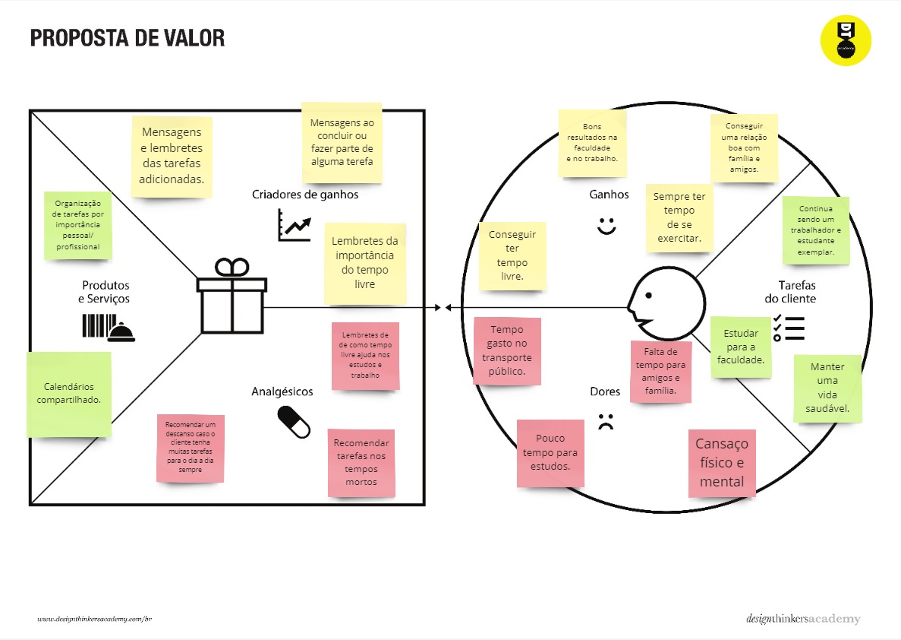

# Introdução

Informações básicas do projeto.

* **Projeto: Tempus Dominus** 
* **Repositório GitHub:** [GERENCIAMENTO DE TEMPO](https://github.com/ICEI-PUC-Minas-PMGES-TI/pmg-es-2024-2-ti1-2010100-gerenciamento-de-tempo/tree/master/docs)
* **Membros da equipe:**

  * [Brian](https://github.com/brianbreder)
  * [Wesley](https://github.com/beltrano) 
  * [Clara](https://github.com/cicrano) 
  * [Nicolas](https://github.com/cicrano)
  * [Cesar](https://github.com/cicrano)

A documentação do projeto é estruturada da seguinte forma:

1. Introdução
2. Contexto
3. Product Discovery
4. Product Design
5. Metodologia
6. Solução
7. Referências Bibliográficas

✅ [Documentação de Design Thinking (MIRO)](files/processo-dt.pdf)

# Contexto

*A gestão de tempo refere-se à habilidade de planejar e executar o uso do tempo de forma eficiente. No entanto, muitas pessoas enfrentam dificuldades em organizar suas atividades diárias, resultando em uma série de problemas que afetam tanto o desempenho profissional quanto a qualidade de vida pessoal.*

*Procuramos conseguir: Aumento da Produtividade, Redução do Estresse, Melhora nas Relações Pessoais, Estabelecer Rotinas Saudáveis, Gerenciar o Tempo de Descanso, Fomentar Boas Relações*

*Nosso público são pessoas neurodivergentes, jovens estudantes, podendo também ser usado por empresas, escolas dentre outros*

## Gerenciamento de tempo

**Em um mundo cada vez mais acelerado, a gestão do tempo se tornou um desafio significativo para muitas pessoas. A falta de uma rotina equilibrada pode levar ao estresse, à baixa produtividade e a uma deterioração das relações interpessoais. Para enfrentar esse problema, estamos desenvolvendo um método inovador que auxilia os usuários na organização de suas atividades diárias, promovendo uma rotina mais saudável que inclui tempo para descanso e socialização com a família e amigos.** 

## Objetivos

**Aumento da Produtividade: Com uma gestão de tempo mais eficiente, os usuários poderão concluir suas tarefas diárias de forma mais rápida e eficaz.**

**Redução do Estresse: A inclusão de momentos de descanso e socialização contribuirá para uma melhor saúde mental e emocional.**

**Melhora nas Relações Pessoais: Reservar tempo para amigos e familiares ajudará a fortalecer vínculos e melhorar a qualidade de vida.**

**Estabelecer Rotinas Saudáveis: O método ajudará os usuários a criarem uma estrutura diária que inclua não apenas tarefas profissionais, mas também momentos de lazer e autocuidado.**

**Não tratar tratar o sono como um mal necessário: O sono regula todo o nosso metabolismo, uma noite mal dormida impacta todo o nosso dia a dia**

**Gerenciar o Tempo de Descanso: Reconhecendo a importância do descanso, o método irá sugerir pausas estratégicas e horários de relaxamento, ajudando a prevenir o burnout.**

**Fomentar Boas Relações: Através de lembretes e sugestões de interação social, isso incentivará os usuários a reservarem tempo para se conectar com amigos e familiares, promovendo um ambiente social saudável.**

**Para solucionarmos esse problema e chegarmos a estes objetivos, vamos projetar um software com integração com o usuário, buscando o melhor planejamento do seu tempo e suas tarefas com o apoio de marcadores, alertas, mensagens motivacionais, marcadores personalizados para cada tipo de tarefa e muito mais, buscando também estabelecer uma rotina saudável com o contato de amigos e familiares**

## Justificativa

*No mundo atual, a crescente demanda de alta produtividade gera situações de estresse que muitas das vezes dificulta a realização de até mesmo tarefas básicas ao estudante. Esse cenário é ainda pior quando se trata de pessoas neuro divergentes que possuem dificuldade de ser organizar ou de prestar atenções em determinados assuntos. Dessa forma, a gestão do tempo se torna essencial. E o nosso software irá atender essa necessidade, oferecendo uma série de funcionalidades que ajudam os usuários a organizarem seus dias de forma eficiente e equilibrada. Afinal, segundo o princípio de Pareto, "80% dos resultados vem de 20% dos esforços", pois tendemos a quanto maior o prazo, maior o tempo qu demoramos para começar.*

*Equilíbrio entre Trabalho e Lazer: Ao integrar atividades de lazer na programação, os usuários conseguem manter um estilo de vida mais saudável, evitando o estresse e o esgotamento.*

*O uso do nosso software de gerenciamento de tempo não é apenas uma questão de organização; trata-se de promover um estilo de vida equilibrado e saudável. Com funcionalidades que priorizam a importância das tarefas, proporcionam um planejamento visual claro, lembram da necessidade de descanso e incentivam atividades sociais e de lazer, este software é uma ferramenta indispensável para quem busca otimizar sua rotina e melhorar sua qualidade de vida. Ao adotar essa solução, os usuários estarão investindo em um futuro mais equilibrado e satisfatório para si.*

## Público-Alvo

**Pessoas neurodivergentes**

**Estudantes e trabalhadores**

**Empresas**

**Escolas**

**Dentre outros**

# Product Discovery

## Etapa de Entedimento


## Etapa de Definição


# Product Design

Nesse momento, vamos transformar os insights e validações obtidos em soluções tangíveis e utilizáveis. Essa fase envolve a definição de uma proposta de valor, detalhando a prioridade de cada ideia e a consequente criação de wireframes, mockups e protótipos de alta fidelidade, que detalham a interface e a experiência do usuário.

## Histórias de Usuários

Com base na análise das personas foram identificadas as seguintes histórias de usuários:

| EU COMO...`PERSONA` | QUERO/PRECISO ...`FUNCIONALIDADE`        | PARA ...`MOTIVO/VALOR`               |
| --------------------- | ------------------------------------------ | -------------------------------------- |
| Marcelo   | Calendário intregado      | Acompanhar as tarefas em uma linha do tempo|
| Marcelo         | Poder receber notificações de lembretes anuais      | Poder me planejar melhor quando um aniversário estiver chegando |
| Marcelo   | Calendários compartilhados      | Me organizar com meus colegas de salas e professores|
| Marcelo   | Uma área específica para me ajudar nos estudos      | Otimizar meu tempo e melhorar meu aproveitamento nas aulas|
| Yasmin  | Lembretes personalizados      |Não ter que criar uma ou mais tarefas para a mesma atividade|
| Yasmin   | Poder compartilhar a parte da minha rotina de horários livres com meus familiares e amigos      | Criar uma rotina saudável para aproveitar melhor o tempo|
| Yasmin   | Criar plano de estudos para a faculdade      | Otimização de tempo das atividades|
| Yasmin   | Criar  uma rotina  de leitura constante      | Criar e manter um abito saudável|
| Heitor   | Poder receber dicas e me informar sobre como estruturar um rotina      | Poder me organizar da maneira mais efetiva possível|
| Heitor   | Tarefas flutuantes na tela (personalizáveis)      | Ter um melhor contraste e localizar minhas anotações facilmente|
| Heitor   | Ter dicas sobre estrutura uma rotina saudável      | Poder ser  mais produtivo|
| Heitor   | Controle de tempo gasto em jogos      | Ter melhor controle do tempo gasto|

> **Orientações**:
>
> - [Histórias de usuários com exemplos e template](https://www.atlassian.com/br/agile/project-management/user-stories)
> - [Como escrever boas histórias de usuário (User Stories)](https://medium.com/vertice/como-escrever-boas-users-stories-hist%C3%B3rias-de-usu%C3%A1rios-b29c75043fac)

## Proposta de Valor

##### Proposta para Persona Marcos



#### Proposta para Persona Yasmim


#### Propost para Persona Heitor


## Requisitos

As tabelas que se seguem apresentam os requisitos funcionais e não funcionais que detalham o escopo do projeto.

### Requisitos Funcionais

| ID     | Descrição do Requisito                                   | Prioridade |
| ------ | ---------------------------------------------------------- | ---------- |
| RF-001 | Permitir que o usuário faça seu cadastro usando o e-mail | ALTA       |
| RF-002 | Oferecer a opção de vincular as contas de 1 ou mais usuários | ALTA   |
| RF-003 | Emitir um relatório de tarefas no mês  | MÉDIA     |
| RF-004 | Permitir que o usuário classifique suas tarefas por importância | MÉDIA |
| RF-005 | Alertas para manter o foco do usuário durante tarefas | MÉDIA  |
| RF-006 | Permitir que o usuário faça o upload de arquivos   | BAIXA | 
| RF-007 | Oferecer ao usuário artigos e dicas para se organizar de forma efetiva | ALTA|
|RF-008 | Área específica para organizar seus hobbies, esportes e momentos de lazer | ALTA  | 
|RF-009 | Sincronizar suas tarefas com a da sua empresa\instituição de ensino  | ALTA  |
|RF-010 | Oferecer Manual de Ajuda para o uso do sistema para o usuário | ALTA  | 


### Requisitos não Funcionais

| ID      | Descrição do Requisito                                                              | Prioridade |
| ------- | ------------------------------------------------------------------------------------- | ---------- |
| RNF-001 | O sistema deve ser responsivo para IOS e Android   | MÉDIA |
| RNF-002 | Deve processar requisições do usuário em no máximo 3s    | BAIXA      |
| RNF-003 | O sistema deve rodar em computadores e dispositivos móveis | ALTA  | 
| RNF-004 | O sistema deve proteger os dados do usuário usados no cadastro  | ALTA |


## Projeto de Interface

Artefatos relacionados com a interface e a interacão do usuário na proposta de solução.

### Wireframes

Estes são os protótipos de telas do sistema.

https://www.figma.com/design/mLzy3v1RB38FtikvkB5V4X/Gest%C3%A3o-de-tempo?node-id=0-1&t=GlyHb2ai4692gPbC-1

# Metodologia

Detalhes sobre a organização do grupo e o ferramental empregado.

## Ferramentas

Relação de ferramentas empregadas pelo grupo durante o projeto.

| Ambiente                    | Plataforma | Link de acesso                                     |
| --------------------------- | ---------- | -------------------------------------------------- |
| Processo de Design Thinking | Miro       | https://miro.com/XXXXXXX ⚠️ EXEMPLO ⚠️        |
| Repositório de código     | GitHub     | https://github.com/XXXXXXX ⚠️ EXEMPLO ⚠️      |
| Hospedagem do site          | Render     | https://site.render.com/XXXXXXX ⚠️ EXEMPLO ⚠️ |
| Protótipo Interativo       | MarvelApp  | https://marvelapp.com/XXXXXXX ⚠️ EXEMPLO ⚠️   |
|                             |            |                                                    |

> ⚠️ **APAGUE ESSA PARTE ANTES DE ENTREGAR SEU TRABALHO**
>
> Liste as ferramentas empregadas no desenvolvimento do projeto, justificando a escolha delas, sempre que possível. Inclua itens como: (1) Editor de código, (2) )ferramentas de comunicação, (3) )ferramentas de diagramação, (4) )plataformas de hospedagem, entre outras.

## Gerenciamento do Projeto

Divisão de papéis no grupo e apresentação da estrutura da ferramenta de controle de tarefas (Kanban).


> ⚠️ **APAGUE ESSA PARTE ANTES DE ENTREGAR SEU TRABALHO**
>
> Nesta parte do documento, você deve apresentar  o processo de trabalho baseado nas metodologias ágeis, a divisão de papéis e tarefas, as ferramentas empregadas e como foi realizada a gestão de configuração do projeto via GitHub.
>
> Coloque detalhes sobre o processo de Design Thinking e a implementação do Framework Scrum seguido pelo grupo. O grupo poderá fazer uso de ferramentas on-line para acompanhar o andamento do projeto, a execução das tarefas e o status de desenvolvimento da solução.
>
> **Orientações**:
>
> - [Sobre Projects - GitHub Docs](https://docs.github.com/pt/issues/planning-and-tracking-with-projects/learning-about-projects/about-projects)
> - [Gestão de projetos com GitHub | balta.io](https://balta.io/blog/gestao-de-projetos-com-github)
> - [(460) GitHub Projects - YouTube](https://www.youtube.com/playlist?list=PLiO7XHcmTsldZR93nkTFmmWbCEVF_8F5H)
> - [11 Passos Essenciais para Implantar Scrum no seu Projeto](https://mindmaster.com.br/scrum-11-passos/)
> - [Scrum em 9 minutos](https://www.youtube.com/watch?v=XfvQWnRgxG0)

# Solução Implementada

Esta seção apresenta todos os detalhes da solução criada no projeto.

## Vídeo do Projeto

O vídeo a seguir traz uma apresentação do problema que a equipe está tratando e a proposta de solução. ⚠️ EXEMPLO ⚠️

[](https://www.youtube.com/embed/70gGoFyGeqQ)

> ⚠️ **APAGUE ESSA PARTE ANTES DE ENTREGAR SEU TRABALHO**
>
> O video de apresentação é voltado para que o público externo possa conhecer a solução. O formato é livre, sendo importante que seja apresentado o problema e a solução numa linguagem descomplicada e direta.
>
> Inclua um link para o vídeo do projeto.

## Funcionalidades

Esta seção apresenta as funcionalidades da solução.Info

##### Funcionalidade 1 - Cadastro de Contatos ⚠️ EXEMPLO ⚠️

Permite a inclusão, leitura, alteração e exclusão de contatos para o sistema

* **Estrutura de dados:** [Contatos](#ti_ed_contatos)
* **Instruções de acesso:**
  * Abra o site e efetue o login
  * Acesse o menu principal e escolha a opção Cadastros
  * Em seguida, escolha a opção Contatos
* **Tela da funcionalidade**:


> ⚠️ **APAGUE ESSA PARTE ANTES DE ENTREGAR SEU TRABALHO**
>
> Apresente cada uma das funcionalidades que a aplicação fornece tanto para os usuários quanto aos administradores da solução.
>
> Inclua, para cada funcionalidade, itens como: (1) titulos e descrição da funcionalidade; (2) Estrutura de dados associada; (3) o detalhe sobre as instruções de acesso e uso.

## Estruturas de Dados

Descrição das estruturas de dados utilizadas na solução com exemplos no formato JSON.Info

##### Estrutura de Dados - Contatos   ⚠️ EXEMPLO ⚠️

Contatos da aplicação

```json
  {
    "id": 1,
    "nome": "Leanne Graham",
    "cidade": "Belo Horizonte",
    "categoria": "amigos",
    "email": "Sincere@april.biz",
    "telefone": "1-770-736-8031",
    "website": "hildegard.org"
  }
  
```

##### Estrutura de Dados - Usuários  ⚠️ EXEMPLO ⚠️

Registro dos usuários do sistema utilizados para login e para o perfil do sistema

```json
  {
    id: "eed55b91-45be-4f2c-81bc-7686135503f9",
    email: "admin@abc.com",
    id: "eed55b91-45be-4f2c-81bc-7686135503f9",
    login: "admin",
    nome: "Administrador do Sistema",
    senha: "123"
  }
```

> ⚠️ **APAGUE ESSA PARTE ANTES DE ENTREGAR SEU TRABALHO**
>
> Apresente as estruturas de dados utilizadas na solução tanto para dados utilizados na essência da aplicação quanto outras estruturas que foram criadas para algum tipo de configuração
>
> Nomeie a estrutura, coloque uma descrição sucinta e apresente um exemplo em formato JSON.
>
> **Orientações:**
>
> * [JSON Introduction](https://www.w3schools.com/js/js_json_intro.asp)
> * [Trabalhando com JSON - Aprendendo desenvolvimento web | MDN](https://developer.mozilla.org/pt-BR/docs/Learn/JavaScript/Objects/JSON)

## Módulos e APIs

Esta seção apresenta os módulos e APIs utilizados na solução

**Images**:

* Unsplash - [https://unsplash.com/](https://unsplash.com/) ⚠️ EXEMPLO ⚠️

**Fonts:**

* Icons Font Face - [https://fontawesome.com/](https://fontawesome.com/) ⚠️ EXEMPLO ⚠️

**Scripts:**

* jQuery - [http://www.jquery.com/](http://www.jquery.com/) ⚠️ EXEMPLO ⚠️
* Bootstrap 4 - [http://getbootstrap.com/](http://getbootstrap.com/) ⚠️ EXEMPLO ⚠️

> ⚠️ **APAGUE ESSA PARTE ANTES DE ENTREGAR SEU TRABALHO**
>
> Apresente os módulos e APIs utilizados no desenvolvimento da solução. Inclua itens como: (1) Frameworks, bibliotecas, módulos, etc. utilizados no desenvolvimento da solução; (2) APIs utilizadas para acesso a dados, serviços, etc.

# Referências

As referências utilizadas no trabalho foram:

* SOBRENOME, Nome do autor. Título da obra. 8. ed. Cidade: Editora, 2000. 287 p ⚠️ EXEMPLO ⚠️

> ⚠️ **APAGUE ESSA PARTE ANTES DE ENTREGAR SEU TRABALHO**
>
> Inclua todas as referências (livros, artigos, sites, etc) utilizados no desenvolvimento do trabalho.
>
> **Orientações**:
>
> - [Formato ABNT](https://www.normastecnicas.com/abnt/trabalhos-academicos/referencias/)
> - [Referências Bibliográficas da ABNT](https://comunidade.rockcontent.com/referencia-bibliografica-abnt/)
